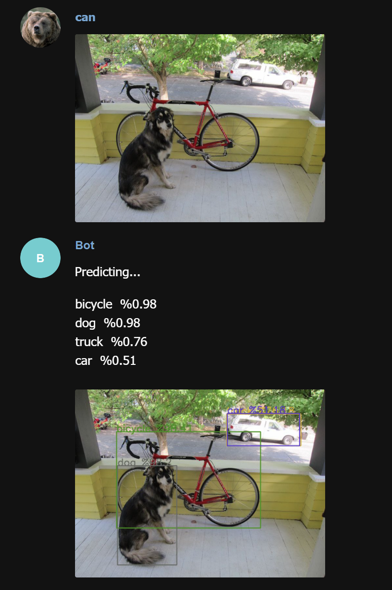
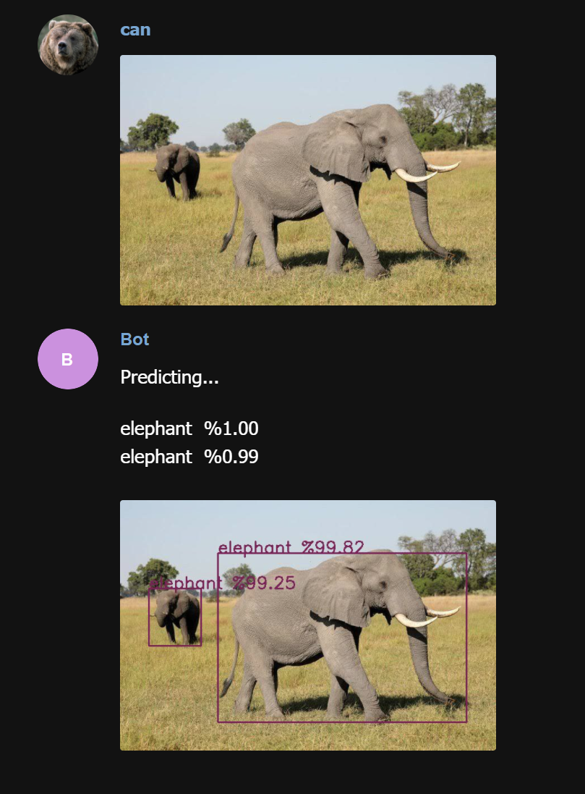

## Telegram predictor
### Telegram yolo predictor bot.
---

  

### **Setting it up**
- Train a model with [darknet yolo.](https://github.com/AlexeyAB/darknet)
- Convert the model to tensorflow, you can use this repo for converting the model [tensorflow-yolov4-tflite.](https://github.com/hunglc007/tensorflow-yolov4-tflite)
- Install requirements.
- Get a telegram bot key.
- Pass model weights folder path, class names file path and botkey to the telegram_bot function.
- It will work. (I hope 🤷🏻‍♂️)

## **Examples**
   
